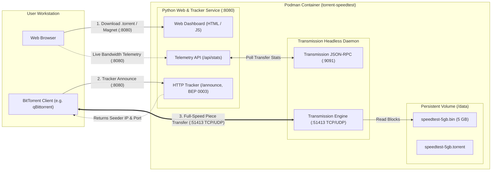
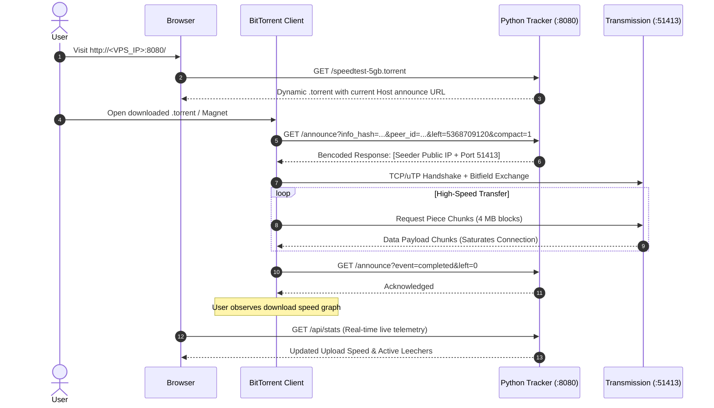
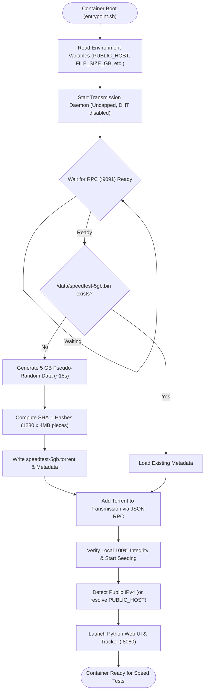

# BitTorrent Speed Test Container

A containerized, self-hosted BitTorrent speed test platform. It packages a **5 GB non-compressible dummy payload generator**, an **embedded BitTorrent HTTP tracker**, a **modern Web UI**, and an **uncapped Transmission seeder daemon** into a single lightweight image.

Designed for testing and saturating high-bandwidth network pipes (e.g. 1 Gbps – 10 Gbps) on public cloud VPS servers (such as `fio.ie`).

---

## Architecture & Data Flow

### System Components



---

### Speed Test Sequence



---

### Startup & Priming Lifecycle



---

## Features

- **Real 5 GB Test Payload**: On first startup, generates a real 5 GB file composed of non-compressible pseudo-random byte patterns (generated in ~15 seconds, hashes cached).
- **Private BitTorrent Flag**: Ensures BitTorrent clients only connect directly to your test server without advertising on DHT or PEX.
- **Embedded Python HTTP Tracker**: Implements BEP 0003 compact peer format, automatically directing downloading clients to the container's public IP and seeder port.
- **Dynamic Announce URL Injection**: When a user downloads `/speedtest-5gb.torrent`, the server dynamically tailors the announce URL to the client's connection host or configured `PUBLIC_HOST`.
- **Integrated Seeder Daemon**: Pre-tuned headless Transmission instance running in the background with uncapped upload bandwidth, 256 upload slots, and high peer limits.
- **Modern Responsive Web UI**: Dark mode dashboard displaying live seeder upload speed (MB/s and Mbps), cumulative data transferred, and active leecher count.
- **Podman & Docker Native**: Built on Alpine Linux with zero third-party Python dependencies (runs on pure Python 3 standard library).

---

## Ports Required

Ensure the following ports are open on your VPS firewall (e.g., `ufw`, `iptables`, cloud security group):

| Port | Protocol | Purpose |
|---|---|---|
| **8080** | TCP | Web UI & BitTorrent HTTP Tracker (`/announce`) |
| **51413** | TCP & UDP | BitTorrent peer wire transfer (Transmission Seeder) |

---

## Quick Start (Podman)

### 1. Build the Image

```bash
podman build -t torrent-speedtest .
```

### 2. Run the Container

#### With Auto-Detected Public IP:
```bash
podman run -d \
  --name torrent-speedtest \
  --restart unless-stopped \
  -p 8080:8080 \
  -p 51413:51413 \
  -p 51413:51413/udp \
  -v torrent_data:/data \
  torrent-speedtest
```

#### With Custom Domain / VPS IP:
```bash
podman run -d \
  --name torrent-speedtest \
  --restart unless-stopped \
  -p 8080:8080 \
  -p 51413:51413 \
  -p 51413:51413/udp \
  -e PUBLIC_HOST=speedtest.fio.ie \
  -v torrent_data:/data \
  torrent-speedtest
```

---

## Running with Podman Compose / Docker Compose

Copy `.env.example` to `.env` and adjust as needed:

```bash
cp .env.example .env
```

Start the service:

```bash
podman-compose up -d
# or: docker compose up -d
```

---

## Configuration Options

Set these environment variables when running the container:

| Variable | Default | Description |
|---|---|---|
| `PUBLIC_HOST` | `auto` | Public IP or domain name of your VPS. If `auto`, the container queries external IP APIs (`ipify`, `ifconfig.me`) on boot. |
| `HTTP_PORT` | `8080` | Port for the Web UI and HTTP tracker announce endpoint. |
| `PEER_PORT` | `51413` | Port for Transmission peer connections (TCP & UDP). |
| `FILE_SIZE_GB` | `5.0` | Size in GB of the dummy test payload. |
| `PIECE_SIZE_MB` | `4` | Piece size in MB for the `.torrent` file. |
| `DATA_DIR` | `/data` | Directory where the test binary and `.torrent` file are stored. |

---

## How to Run a Speed Test

1. Open your browser and navigate to `http://<YOUR_VPS_IP_OR_HOST>:8080`.
2. Click **Download 5GB .torrent** (or copy the **Magnet Link**).
3. Open the torrent file in any client (such as [qBittorrent](https://www.qbittorrent.org/), [Transmission](https://transmissionbt.com/), etc.).
4. The client will announce to your container's tracker and immediately connect to the seeder.
5. Watch your client download speed ramp up to saturate your downstream connection.
6. Check the container Web UI to see real-time seeder upload rate and active leechers.
